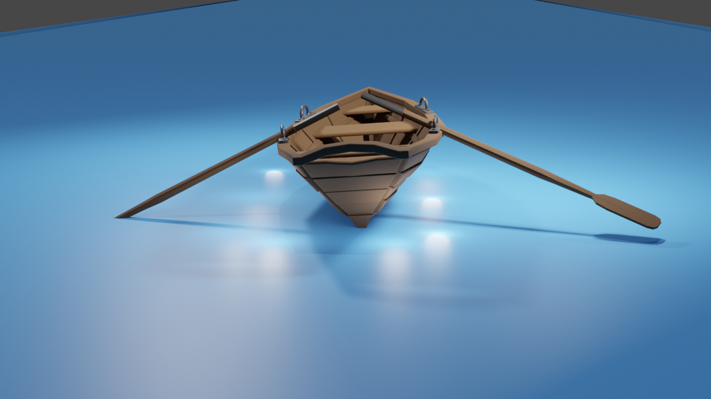
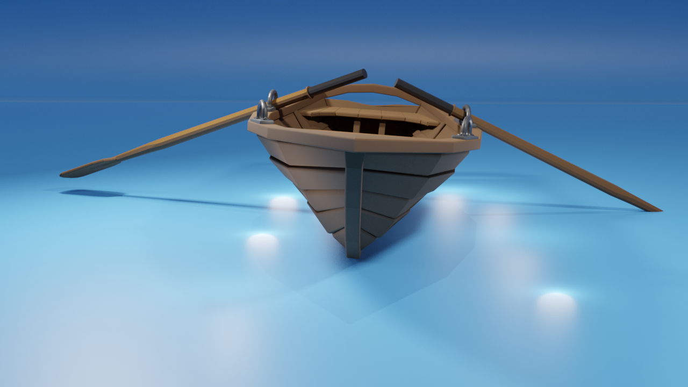

# 3D-Boat
 Simple project to showcase a 3d boat in blender.  (2021)

 ## Project description
Name: 3D-Boat 
Software: Blender 
platform: 3D  
Project No: Update me  
Year: 2021

## Render

    
    
    

## 3D file
* **[Boat](3d/boat.fbx)**

## Authors

* **AbirHasan**

Check out my other works [@XAbirHasan](https://github.com/XAbirHasan)

